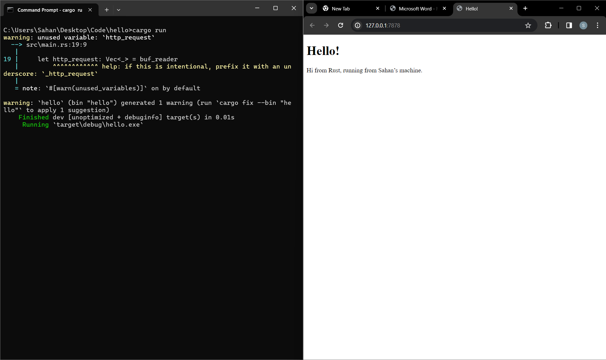
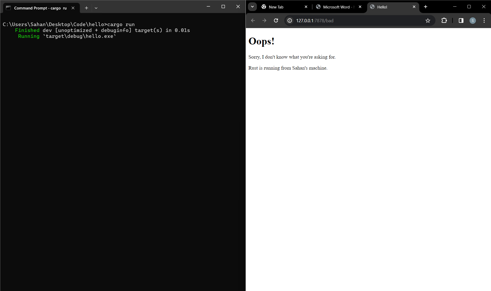

Tutorial 6

Shanahan Danualif Erwin - 2206817420- Adpro B

__1. Commit 1__

What does handle_connection do?

handle_connection berfungsi untuk memproses TCPstream yang masuk. Pertama ada
BufReader yang membungkus TCPstream yang diberikan dengan buffer. Kemudian dilakukan iterasi
melalui setiap baris dari BufReader hingga menemukan baris kosong. Nantinya baris-baris ini dikumpulkan
ke dalam sebuah Vector yang mewakili permintaan HTTP. Terakhir, fungsi akan mencetak permintaan HTTP ke konsol

__2. Commit 2__

What does the additional line of code in handle_connection do?

- Pertama, kode akan memberikan status respons HTTP, kode 200 disini berarti "OK"
- Kedua, baris akan membaca file yang bernama hello.html menggunakan fs::read_to_string()
- Ketiga, menghitung panjang baris dari konten yang akan dikirim dalam tubuh respons HTTP
- Keempat, memformat respons HTTP yang mencakup baris status, header panjang konten, dan sebagainya
- Terakhir, respons HTTP akan ditulis kepada TCPstream dengan write_all

__Commit 3__

Saya menggunakan if-else conditional yang akan membaca request_line. Kalau request_line
berisi "GET / HTTP/1.1" maka kode akan memberikan file hello.html. Sebaliknya, jika
tidak memberikan request sesuai makan akan menampilkan file bad.html. Refactoring kode dilakukan agar
kode menjadi lebih mudah dibaca dan lebih mudah dimodifikasi di masa depan. Hal ini akan meningkatkan maintainability
dari kode ini

__Commit 4__

Saat mengakses endpoint /sleep, aplikasi membutuhkan waktu yang lama (10 detik) untuk memprosesnya. Ketika kita mencoba
mengakses endpoint lain pada tab browser baru, aplikasi harus menyelesaikan proses loading di endpoint /sleep dulu.
Hal ini membuat endpoint lain harus menunggu /sleep selesai loading dulu agar bisa diproses. Padahal endpoint selain /sleep
dapat diproses oleh mesin secara cepat. Secara keseluruhan, ini membuat masalah performa karena 
saat mengakses endpoint /sleep yang membutuhkan banyak waktu akan memperlambat performa aplikasi.

__Commit 5__

